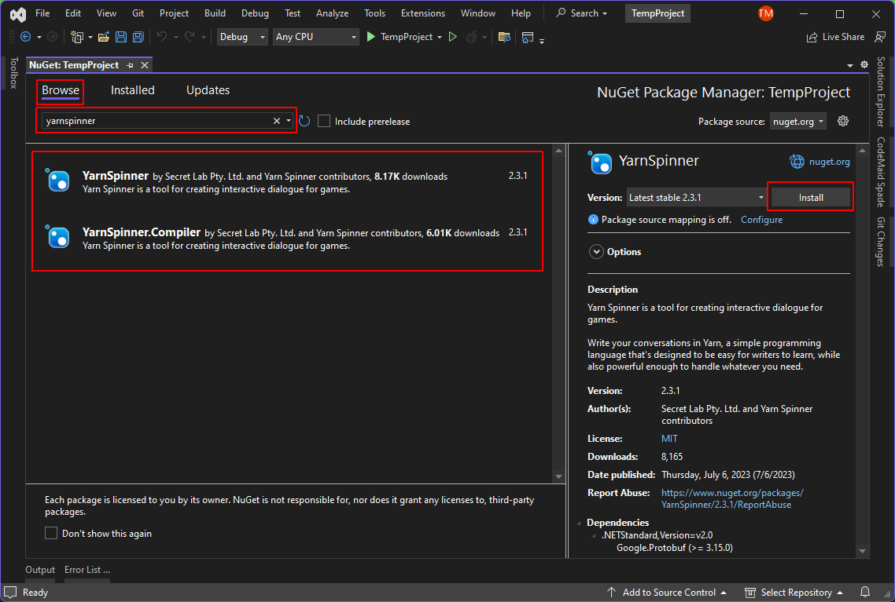

# Yarn Spinner for Godot C#

This plugin is an implementation of the [Yarn Spinner](https://yarnspinner.dev/) tool for writing game dialogue sequences. If you aren't familiar with Yarn Spinner, you can learn more about it by checking out their [documenation](https://docs.yarnspinner.dev/).

This plugin uses C# exclusively. If you are writing your game in GDScript, consider using the awesome [GDYarn plugin](https://godotengine.org/asset-library/asset/747) instead of this one.

The scripts included in this plugin are based on Yarn Spinner's own [Unity package](https://github.com/YarnSpinnerTool/YarnSpinner-Unity), but there are some important differences. See [Migrating from Unity](#migrating-from-unity) for more information.

If you encounter an issue, please report it to the [Github page for this project](https://github.com/tjmclain/YarnSpinner-GodotSharp).

## Table of Contents

1. [Prerequisites](#prerequisites)
1. [Quick Start](#quick-start)
1. [Features](#features)
1. [Migrating from Unity](#migrating-from-unity)
1. [Using async / await in Godot](#using-async--await-in-godot)

## Prerequisites

> **⚠️ Important**
>
> In order for the scripts in this plugin to work correctly, you will need to add the following Yarn Spinner NuGet packages to your C# project.
>
> - https://www.nuget.org/packages/YarnSpinner
> - https://www.nuget.org/packages/YarnSpinner.Compiler/

### Option 1: Add packages via command line

1. Open a terminal window in your Godot project's root folder (or whichever folder has your C# project in it)
2. In the terminal, execute the following commands:
   - `dotnet add package YarnSpinner`
   - `dotnet add package YarnSpinner.Compiler`

### Option 2: Add packages via Visual Studio package manager

If you're using Visual Studio as your IDE for your C# project, you can add these packages via the NuGet Package Manager.

1. Open the Package Manager via **Project > Manage Nuget Packages...**
2. On the **Browse** tab, search for YarnSpinner
3. Install the **YarnSpinner** and **YarnSpinner.Compiler** projects by selecting them in the list and then clicking the **Install** button.



If you encounter any issues with installing these packages, you can consult the official [NuGet documentation](https://learn.microsoft.com/en-gb/nuget/what-is-nuget). If you don't find any an answer to your problem there, please create an issue on this project's [Github page](https://github.com/tjmclain/YarnSpinner-GodotSharp/issues).

## Quick Start

TODO

## Features

### Runtime:

- [x] `DialogueRunner`: runtime Dialogue state control
- [x] `LineProvider`: serves localized dialogue lines to dialogue views
  - [ ] Serve localized audio files
- [x] `VariableStorage`: stores Yarn variables
  - [x] `Variable`: save Yarn variables as Godot `Variant`s during runtime
- [x] `ActionLibrary`: stores Yarn commands and functions
  - [x] Add `YarnCommand` and `YarnFunction` attributes to methods to find them automatically
  - [x] Supports both static and non-static `YarnCommand`s; however, `YarnFunction`s must be static

### Dialogue Views:

- [x] Dialogue View interfaces: implement one or more of these in a custom `Control`
  - [x] IDialogueStartedHandler: receive a callback when dialogue starts
  - [x] IDialogueCompleteHandler: receive a callback when dialogue completes
  - [x] IRunLineHandler: handle presenting and dismissing a line of dialogue
  - [x] IRunOptionsHandler: handle presenting and selecting dialogue options
- [x] [Use `async` / `await` operators](#using-async--await-in-godot) to present dialogue via multithreaded C# `Task`s
- [x] `DialogueViewGroup`: container for other dialogue views or view groups
- [x] `DialogueLine`: displays a line of dialogue and (optionally) the speaking character's name
- [x] `OptionsListView`: displays dialogue options and handles option selection
- [x] `OptionView`: displays a single option

### Yarn Data:

- [x] `YarnProgram`: a '.yarn' file that contains a single yarn program
  - [x] "Add Line ID Tags": optionally generate and assign `lineid` tags to each line in a '.yarn' file
  - [x] "Export Strings For Translation": optionally export a csv file representing a `StringTable`
- [x] `YarnProject`: collects and compiles several yarn programs into one unified program
- [x] `StringTable`: a collection of `StringTableEntry`s that associates a translatable string with its translations and metadata
  - [x] "Lock" field is used to identify when translations are out of date with their source string
  - [x] "CustomFields" stores any custom values imported from the CSV (e.g. if you add a "Comments" field, it will be stored here)

### Examples

This plugin for Godot is similar in many ways to YarnSpinner's offical Unity plugin. The main types used in this plugin are the same, and much of the code is simliar if not exactly the same. However, this code base differs in some important ways, and that means migrating an existing Yarn Spinner project in Unity to Godot using this plugin will require some refactoring.

- Dialogue Runner
  - Uses `async` / `await` operations and `Task`s to handle dialogue flow instead of callbacks.
  - Holds a reference to one `DialogueViewGroup` rather than a list of `DialogueViewBase`s
- Commands
  - Commands can return either `void` or `Task`.
  - Commands cannot return `IEnumerator` because Unity-style `Coroutine`s are not supported in Godot.
- Dialogue Views
  - There is no `DialogueViewBase` class for Dialouge Views to inherit from; instead there are individual interfaces:
    - IDialogueStartedHandler
    - IDialogueCompleteHandler
    - IRunLineHandler
    - IRunOptionsHandler
  - To create a Dialogue View:
    - Create a class that inherits from `Godot.Control` (or one of its subclasses)
    - Implement one or more of the above interfaces in that class
  - Dialogue Views are stored in a `DialogueViewGroup` rather than in `DialougeRunner`
    - `DialogueViewGroup` should be the main container for the other dialogue views
    - `DialogueViewGroup`s can contain other `DialogueViewGroup`s

### TODO

- [ ] Update README 'Quick Start' section
- [ ] Update README 'Migrating from Unity' section
- [ ] Create example scenes to demo addon functionality
- [ ] Allow using Godot's internationalization system for translating strings
- [ ] Add `ITransitionInHandler` and `ITransitionOutHandler` interfaces
- [ ] Create `DialogueViewGroupController` class to allow switching between active view groups
- [ ] Cache certain data offline to optimize `DialogueRunner` startup
  - [ ] Cache `YarnProject` program as a `PackedByteArray`
  - [ ] Cache `YarnProject`'s internal `StringTable`
  - [ ] Cache `ActionLibrary`'s lists of `ActionInfo`s

## Migrating from Unity

TODO

## Using `async` / `await` in Godot

If you're coming to Godot from Unity, you may be used to Unity's coroutine system using `IEnumerator` methods and `yield` statements. Similar functionality in Godot can be achieved using `aysnc` and `await` operators along with methods that return `Task` or `Task<T>`. If you're unfamiliar with these patterns, it may be helpful to refer to some of the following sources:

- ['await' Keyword (Godot)](https://docs.godotengine.org/en/stable/tutorials/scripting/c_sharp/c_sharp_differences.html#doc-c-sharp-differences-await)
- [Task-based asynchronous programming (MSDN)](https://learn.microsoft.com/en-us/dotnet/standard/parallel-programming/task-based-asynchronous-programming)
- [How to: Cancel a Task and Its Children (MSDN)](https://learn.microsoft.com/en-us/dotnet/standard/parallel-programming/how-to-cancel-a-task-and-its-children)

### Deferred Operations in Godot

> **⚠️ IMPORTANT**
>
> If you try to set values or call functions on a Godot `Control` from outside the main thread, the engine may throw an exception. For this reason, it is better to use `GodotObject`'s built-in `SetDeferred` and `CallDeferred` methods from inside any `async` methods in your code.

Every class that derives from GodotObject has access to the `SetDeferred` and `CallDeferred` methods. `SetDeferred` will set a value at the end of the current frame. `CallDeferred` will call a method during 'idle time,' which is usually the end of the frame.

- [SetDeferred (Godot)](https://docs.godotengine.org/en/stable/classes/class_object.html#class-object-method-set-deferred)
- [CallDeferred (Godot)](https://docs.godotengine.org/en/stable/classes/class_object.html#class-object-method-call-deferred)]

Because these are deferred calls, the values will not be set and the calls will not be made immediately. If you have code after one of these deferred calls that requires the call to occur, you should wait until the next frame to do that work by `await`ing the `ProcessFrame` signal in `SceneTree`.

- [SceneTree - Signals (Godot)](https://docs.godotengine.org/en/stable/classes/class_scenetree.html#signals)

The current `SceneTree` can be accessed by calling `GetSceneTree()` on any object that derives from `Godot.Node`.

Note that there are no deferred 'get' methods. 'Getting' a value from a `Control` does not throw an exception.

> **⚠️ IMPORTANT**
>
> Some Godot methods rely on `StringName` parameters to use a 'snake_case' naming convention (used by GDScript) rather than a 'PascalCase' or 'camelCase' convention (used by C#). Because of that, in the case of `SetDeferred` and `CallDeferred` it's best to use the values exposed in `PropertyName` and `MethodName`.

For example:

```cs

var label = new RichTextLabel();

// Don't do this
// This will not work because Godot expects snake_case property and method names
label.CallDeferred("SetText", "Hello World!");
label.SetDeferred("VisibleCharacters", -1);

// Do this instead
label.CallDeferred(RichTextLabel.MethodName.SetText, "Hello World!");
label.SetDeferred(RichTextLabel.PropertyName.VisibleCharacters, -1);

```

### Example Script Using async / await

This script uses a combination of `async` and `await`, `Task` methods, and Godot's `SetDeferred` method to set a `RichTextLabel`'s text and animate it in via a typewriter-style effect. It is a simplified version of what can be found in the `LineView` script included in this plugin.

```cs
[Export]
public RichTextLabel Label { get; set; }

[Export]
public int TypewriterDelayInMilliseconds { get; set; }

public async Task RunLine(LocalizedLine line)
{
	// Use 'CallDeferred' to set the text of the label at the end of the frame.
	Label.CallDeferred(RichTextLabel.MethodName.SetText, line.Text.Text);

	// 'Await' the 'DoTypewriterEffect' task.
	await DoTypewriterEffect();
}

private async Task DoTypewriterEffect()
{
	// Use 'SetDeferred' to set the label's visible character count to 0 at the end of the frame.
	Label.SetDeferred(RichTextLabel.PropertyName.VisibleCharacters, 0);

	// Wait until the next frame.
	// This ensures our deferred calls are processed before we start animating the text.
	await ToSignal(GetTree(), SceneTree.SignalName.ProcessFrame);

	// Cache the total number of characters in the label's text.
	// It's important we do this AFTER awaiting the ProcessFrame signal
	// so that we're certain the label is using the values we set via SetDeferred.
	int characterCount = Label.GetTotalCharacterCount();

	for (int i = 0; i < characterCount; i++)
	{
		// Increment Label's visible character count.
		Label.SetDeferred(RichTextLabel.PropertyName.VisibleCharacters, i + 1);

		// Wait for a certain amount of time before continuing.
		await Task.Delay(TypewriterDelayInMilliseconds);
	}

	// Setting VisibleCharacters to -1 ensures all characters are visible.
	Label.SetDeferred(RichTextLabel.PropertyName.VisibleCharacters, -1);
}
```
